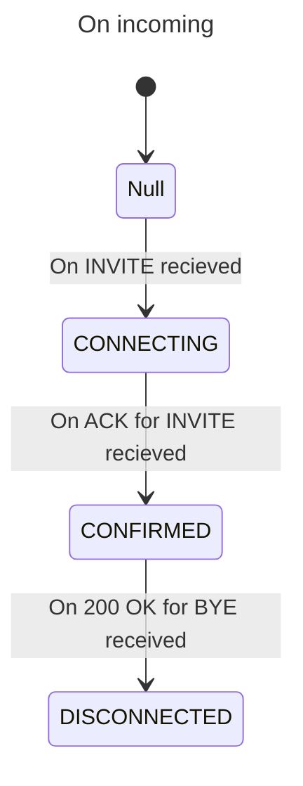
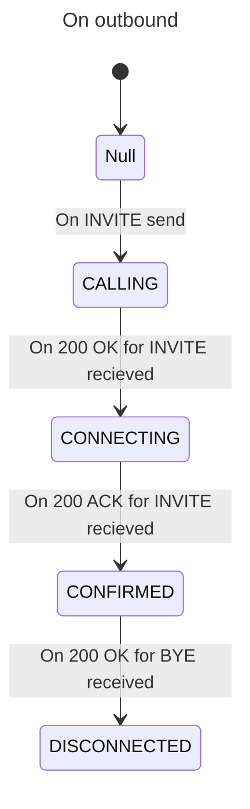

# TODO
- [x] 設定ファイル保存機能の追加
- [ ] 呼び出し音の追加
  - [ ] 着信時に通話を押したら受話する形にする
  - [ ] 呼び出し音の追加
- [ ] DTMF送出機能の追加
- [ ] 保留転送の追加
- [ ] 複数端末で動かす
- [ ] テストを書く(重要)
- [ ] アイコンを付ける

# Softphone state
|PJSIP CallState|Softphone state|
|-|-|
|NULL|DISCONNECTED|
|CALLING|CALLING|
|CONNECTING|CONNECTING|
|CONFIRMED|CONFIRMED|

# メモ
MainWindowのmodは実態を持ち、それ以下のメソッドがt_pjsua_wrapperを受け取り、依存性注入する
