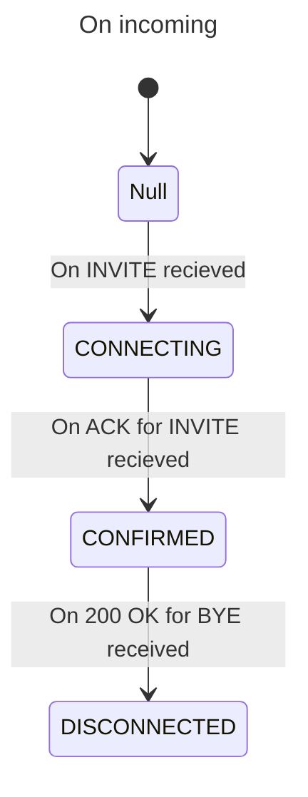
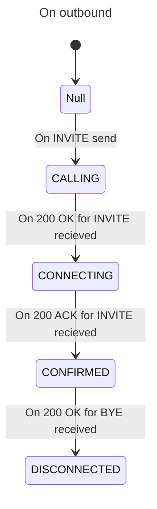

```mermaid
---
title: On incoming
---

stateDiagram-v2
    [*] --> Null
    Null --> CONNECTING : On INVITE recieved
    CONNECTING --> CONFIRMED : On ACK for INVITE recieved
    CONFIRMED --> DISCONNECTED : On 200 OK for BYE received

```

```mermaid
---
title: On outbound
---

stateDiagram-v2
    [*] --> Null
    Null --> CALLING : On INVITE send
    CALLING --> CONNECTING : On 200 OK for INVITE recieved
    CONNECTING --> CONFIRMED : On 200 ACK for INVITE recieved
    CONFIRMED --> DISCONNECTED : On 200 OK for BYE received

```

# Softphone state
|PJSIP CallState|Softphone state|
|-|-|
|NULL|DISCONNECTED|
|CALLING|CALLING|
|CONNECTING|CONNECTING|
|CONFIRMED|CONFIRMED|